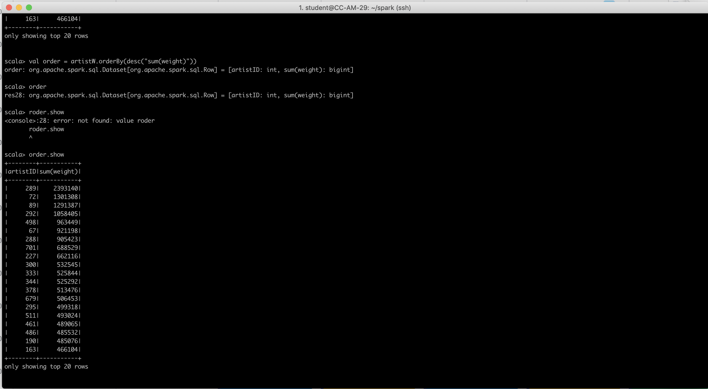

## Part 2

user_artists.dat:

* userID	artistID	weight
* 2	51	13883
* 2	52	11690
* 2	53	11351
* 2	54	10300
* 2	55	8983

Main Steps:

Load the dataset as RDD:

`> val lines = sc.textFile("YOUR_SPARK_HOME/user_artists.dat")`

Construct custome data schema:

`val schema = StructType(colNames.map(fieldName => StructField(fieldName, IntegerType)))`

Transform the RDD into spark DateFrame:

`val data = spark.createDataFrame(rowRDD,schema)`

Get Result by impelmenting spark SQL query on dataframe. Group by artist ID and sum the weight. Order in descending order:

`val artistW = data.groupBy("artistID").agg(sum("weight"))`
`val order = artistW.orderBy(desc("sum(weight)"))`

Show the result dataframe:

 