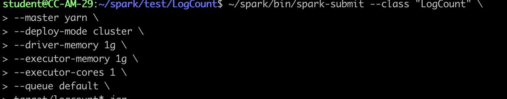
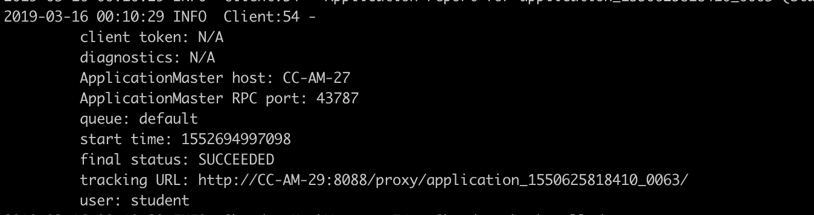
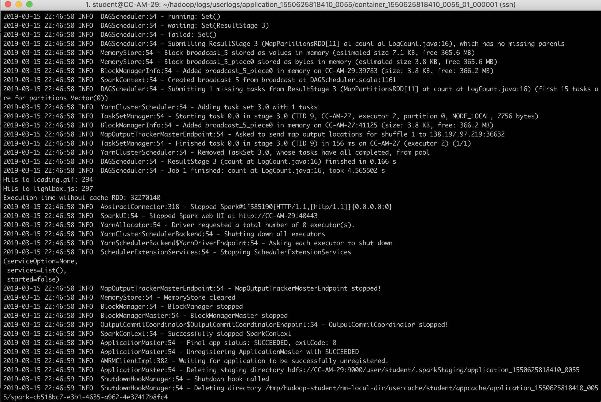
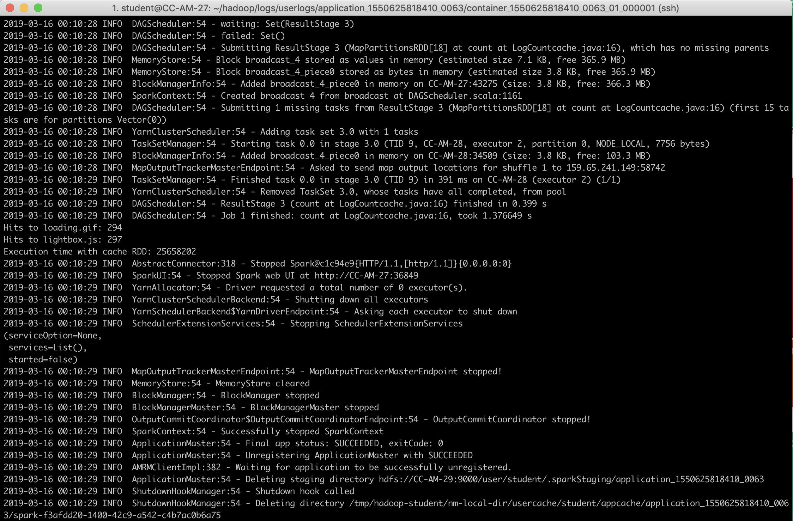

# Part 3

### Question 1&2

Based on the SimpleExamle Java program, develope two java program one with cache RDD one without.

**LogCount.java**

count the hits to '/assets/img/loading.gif' and '/assets/js/lightbox.js' without using cache.

`Dataset<String> logData = spark.read().textFile(logFile);` 

Load RDD Dataset twice in counting jobs

`long numAs = logData.filter(s -> s.contains("/assets/img/loading.gif")).count();`

`long numBs = logData.filter(s -> s.contains("/assets/js/lightbox.js")).count();`

Running time estimation:

`import java.util.concurrent.TimeUnit;
...`
`long startTime = System.nanoTime();`
`// counting jobs`
`long endTime = System.nanoTime();`
`//Running time in nano seconds`
`long timeElapsed = endTime - startTime;`

Submit jar file using spark-submit with cluster mode:

Output:

As shown in the figure below:

Hits to the ....loading.gif: 294

Hits to the ....lightbox.js: 297

Running time without cache RDD: 32270140 (Microseconds (µs))

**LogCountcache.java**

Using RDD cache, load the data into spark memory once

`Dataset<String> logData = spark.read().textFile(logFile).cache();`

Output:

Running time with cache RDD:    25658202 (Microseconds (µs))

