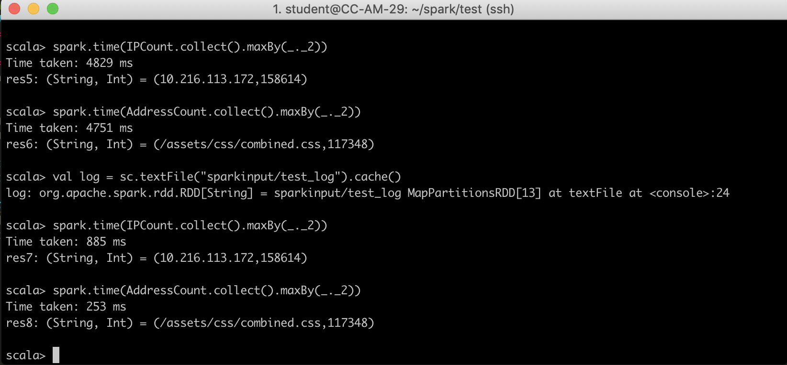

# Part 3
### Question 3&4

In question 3 and 4, we use spark build-in map and reduce funtion to count the hits of each IP or address.

**Key Point:** in these section, we manipulate the lazy evaluation characteristic of Spark RDD to run the mapreduce job and evaluate running time.

Lazy evaluation in Spark means that the execution will not start until an action is triggered. Transformations are lazy in nature meaning when we call some operation in RDD, it does not execute immediately. Spark maintains the record of which operation is being called(Through DAG). We can think Spark RDD as the data, that we built up through transformation.

**Steps:**

1. Construct RDDs with build-in map and reduce function. Aiming at key-value pair for further counting and sorting.

	`val log = sc.textFile("sparkinput/test_log")`
	
	`// after spliting, for every line first element is IP address while 7th element is hit address`
	
	`val IPPair = log.map{line =>
     | val p = line.split(" ")
     | (p(0),1)
     | }`
     
    `val IPCount = IPPair.reduceByKey(_+_)`
 
2. Using spark.time() to start the execution and estimate running time. 
	
	`spark.time(IPCount.collect().maxBy(_._2))`
	
	RDD.collect() would return an collection of after reducing key-value pair. _.maxBy() would return the key with largest value.
	
3. Use cache RDD to execute the operation again and estimate running time.

#### Output

Most hit IP: 10.216.113.172.  158614 times

Running time without cache RDD: 4829ms

Running time with cache RDD:	  885ms

Most hit address: /assets/css/combined.css.   117348 times.

 Running time without cache RDD: 4571 ms
 
 Running time with cache RDD:	  253ms

